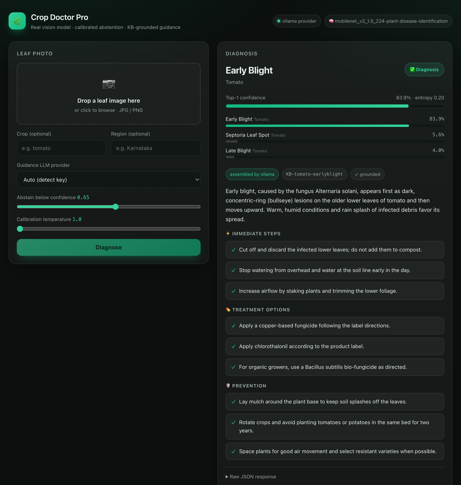
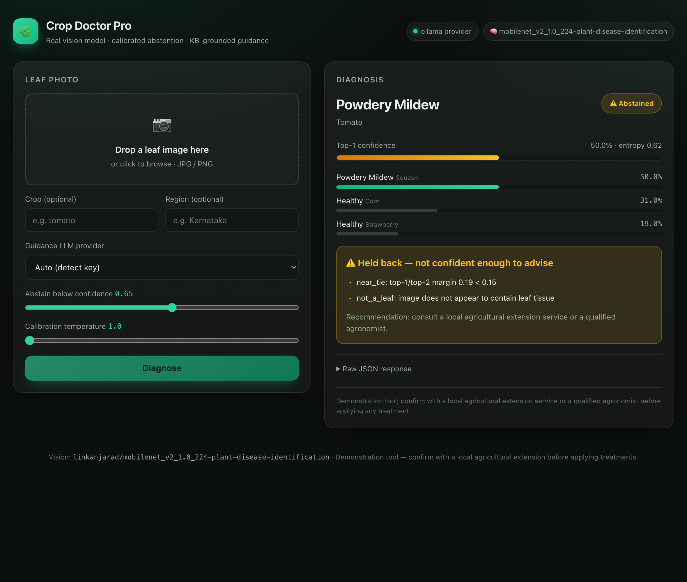

<div align="center">

# 🌿 Crop Doctor Pro

**Snap a leaf → a real vision model diagnoses the disease → you get treatment guidance grounded in a curated knowledge base — and the system *abstains and points you to an expert* whenever it isn't sure.**

[](https://www.python.org/)
[](tests/)
[](#architecture)
[](#choosing-your-llm-youre-not-locked-to-one-vendor)
[](LICENSE)

</div>

> **The split that makes this safe:** the *vision model* decides the disease — the LLM never does. The LLM only **rephrases** treatment guidance pulled from a curated, source-cited knowledge base for the predicted class, and every output passes a **faithfulness check**. When confidence is low, the system **declines to advise**.

This is a from-scratch, **working** implementation of that brief — built to beat a [reference project](https://github.com/Zumitify/crop-disease-identifier) with the same goal whose vision model is **entirely stubbed** (it asks *you* to type the probabilities; the image is never looked at).

---

## 📸 See it

| Diagnosis (confident) | Abstention (unsure / not a leaf) |
|---|---|
|  |  |

<div align="center"><em>Modern web UI — drag-drop a photo, real-model prediction, calibrated confidence, KB-grounded guidance, and a clear "held back" state with reasons.</em></div>

---

## Contents

- [Why this beats the reference project](#why-this-beats-the-reference-project)
- [Architecture](#architecture)
- [Quick start](#quick-start)
- [Choosing your LLM](#choosing-your-llm-youre-not-locked-to-one-vendor)
- [How abstention works](#how-abstention-works)
- [Output shape](#output-shape)
- [Train your own model](#train-your-own-model)
- [Knowledge base](#knowledge-base)
- [Project layout](#project-layout)
- [Responsible use](#responsible-use)

---

## Why this beats the reference project

The reference project (`Zumitify/crop-disease-identifier`) is well-structured, but its classifier is a **stub** — `StubClassifier` ignores the image and returns probabilities you pass in by hand (`--pred tomato_earlyblight=0.88`). The hard, interesting part — turning a leaf photo into a prediction — is missing, and it's CLI-only with template guidance, no calibration, no OOD handling, no LLM, and no evaluation.

| Capability | Reference (`Zumitify`) | **Crop Doctor Pro** |
|---|---|---|
| **Vision model** | ❌ Stub; you type the probabilities | ✅ **Real** model; takes an actual `leaf.jpg` |
| Input | Hand-entered class probs | ✅ Image file / drag-dropped photo (+ optional crop, region) |
| Confidence calibration | Described, not built | ✅ Temperature scaling (+ NLL fitter & ECE eval) |
| Abstention signals | Confidence + near-tie | ✅ Confidence, near-tie, **entropy**, **image quality / OOD**, **crop mismatch** |
| Out-of-distribution input | — | ✅ "not a leaf / blurry / too dark" → abstain |
| Guidance | Templates only | ✅ **Provider-agnostic LLM** (OpenAI · Anthropic · Ollama) **or** deterministic — your call |
| Faithfulness / grounding | Source attribution | ✅ Grounding check that rejects hallucinated treatments → auto-fallback |
| Knowledge base | YAML | ✅ YAML, **27 entries / 6 crops**, validated on load |
| Interface | CLI only | ✅ CLI **and** a modern web UI (FastAPI + custom frontend) |
| Train your own | Described | ✅ Runnable PlantVillage fine-tune + calibration pipeline |
| Evaluation | — | ✅ Accuracy + **ECE** + **risk–coverage** harness |
| Tests | pytest | ✅ **17** tests, deterministic, no download |

It keeps the reference's good bones — plug-in classifier protocol, KB as the single source of truth, abstention-as-success, a mandatory disclaimer — and supplies everything it was missing.

---

## Architecture

```
 leaf image
     │
     ▼
┌─────────────┐   ┌──────────────┐   ┌───────────┐   ┌────────────┐   ┌───────────────┐
│ Vision layer│──▶│ Confidence   │──▶│ KB lookup │──▶│ Guidance   │──▶│ Faithfulness  │──▶ JSON / UI
│ real model, │   │ gate         │   │ curated   │   │ LLM or     │   │ grounded? else│
│ calibrated  │   │ (abstain?)   │   │ YAML      │   │ template   │   │ fallback      │
└─────────────┘   └──────────────┘   └───────────┘   └────────────┘   └───────────────┘
     │                   │
 distribution +     abstain ⇒ no guidance,
 entropy + quality  recommend an expert
```

- **`cropdoctor/vision/`** — `HFClassifier` (real Hugging Face model on CPU), temperature-scaling calibration, image-quality / leaf-likeness checks, plus a `StubClassifier` for tests. Swap in any checkpoint via `model_id`.
- **`cropdoctor/gate/`** — combines top-1 confidence, top-1/top-2 margin, predictive entropy, image quality (blur / dark / not-a-leaf) and crop mismatch. **Abstention is a success state.**
- **`cropdoctor/kb/`** — curated YAML, one entry per disease class, validated on load (with a guard against the `- Foo: bar` YAML-becomes-dict trap).
- **`cropdoctor/llm/`** — provider-agnostic: `openai`, `anthropic`, `ollama`, and a `deterministic` no-LLM path. Auto-detects keys; always degrades gracefully so it runs offline with zero config.
- **`cropdoctor/guidance/`** — builds the prompt from the KB entry, calls the chosen provider, parses, and verifies.
- **`cropdoctor/faithfulness/`** — guarantees no treatment appears that isn't grounded in the KB; on any drift it discards the LLM output and uses the KB-verbatim composer.

---

## Quick start

```bash
git clone https://github.com/SaiSreekarJakku/crop-doctor-pro
cd crop-doctor-pro
python3 -m venv .venv && source .venv/bin/activate
pip install -r requirements.txt          # torch, transformers, fastapi, ...

# 1) Diagnose a real leaf photo (downloads a ~14 MB model on first run)
python -m cropdoctor diagnose examples/tomato_early_blight.jpg --crop tomato

# 2) Watch it abstain on an out-of-distribution image
python -m cropdoctor diagnose examples/not_a_leaf.png

# 3) Raw JSON (machine-readable)
python -m cropdoctor diagnose examples/apple_scab.jpg --json

# 4) Launch the modern web UI — drag a photo in the browser
python -m cropdoctor serve               # http://127.0.0.1:7860
# python -m cropdoctor serve-gradio      # legacy Gradio UI (fallback)

# 5) Inspect the knowledge base / providers, and run tests
python -m cropdoctor info
pytest -q
```

> **Python:** developed on 3.9; runs on 3.9–3.12. On Python 3.9 the *fallback* Gradio UI is pinned to `gradio==4.44.1` with a documented monkeypatch for a gradio_client bug — but the **default** UI is FastAPI and has no such constraint.

---

## Choosing your LLM (you're not locked to one vendor)

Any LLM can assemble the guidance — or none at all. The provider is swappable; the safety guarantees are not.

```bash
# OpenAI / ChatGPT
export OPENAI_API_KEY=sk-...                 # optional: OPENAI_MODEL=gpt-4o-mini
python -m cropdoctor diagnose leaf.jpg --provider openai

# Anthropic / Claude
export ANTHROPIC_API_KEY=...                 # optional: ANTHROPIC_MODEL=claude-sonnet-4-6
python -m cropdoctor diagnose leaf.jpg --provider anthropic

# Ollama — local models, OR cloud models like gpt-oss:120b
export OLLAMA_MODEL=llama3.1                  # local, fully offline
#   …or Ollama Cloud:
export OLLAMA_HOST=https://ollama.com
export OLLAMA_API_KEY=...                     # from ollama.com/settings/keys
export OLLAMA_MODEL=gpt-oss:120b
python -m cropdoctor diagnose leaf.jpg --provider ollama

# No LLM — deterministic, KB-verbatim (the default when no key is found)
python -m cropdoctor diagnose leaf.jpg --provider none
```

Selection order: `--provider` flag → `LLM_PROVIDER` env → auto-detected key → `deterministic`. Settings can also live in a gitignored `.env` (see `.env.example`). **Whatever you pick, the LLM may only rephrase KB content** — the faithfulness check rejects anything it invents and silently falls back to the deterministic composer.

---

## How abstention works

The gate trips — and the system declines to advise — if **any** signal fires:

| Signal | Example reason in output |
|---|---|
| Low calibrated confidence | `low_confidence: top probability 0.52 < 0.65` |
| Near-tie between top-2 | `near_tie: top-1/top-2 margin 0.05 < 0.15` |
| High predictive entropy | `high_entropy: 0.61 > 0.55 (model is hedging)` |
| Out-of-distribution image | `not_a_leaf: image does not appear to contain leaf tissue` |
| Blurry / dark / washed-out | `blurry_image: photo is too out of focus to trust` |
| Crop you specified ≠ prediction | `crop_mismatch: you specified 'tomato' but the model predicts a 'grape' leaf` |
| Confident class with no KB entry | `no_kb_entry: 'soybean_healthy' is not in the curated knowledge base` |

When it abstains, `guidance` is `null` and the response recommends a local agricultural extension or agronomist — it never guesses.

---

## Output shape

```json
{
  "crop": "tomato",
  "prediction": {
    "disease": "Early Blight",
    "confidence": 0.8394,
    "top_3": [{"disease": "Early Blight", "crop": "tomato", "prob": 0.8394}, "..."],
    "backend": "hf:linkanjarad/mobilenet_v2_1.0_224-plant-disease-identification",
    "entropy": 0.202
  },
  "abstained": false,
  "gate": { "abstain": false, "reasons": [], "signals": { "margin": 0.78 } },
  "guidance": {
    "summary": "Early blight, caused by Alternaria solani, appears as dark concentric-ring lesions ...",
    "immediate_steps": ["Cut off and discard the infected lower leaves; do not compost them", "..."],
    "treatment_options": ["Apply a copper-based fungicide following the label directions", "..."],
    "prevention": ["Lay mulch around the plant base to keep soil splashes off the leaves", "..."],
    "sources": ["KB-tomato-earlyblight"],
    "provider": "ollama",
    "faithfulness": { "faithful": true, "sources": ["KB-tomato-earlyblight"] }
  },
  "disclaimer": "Demonstration tool; confirm with a local agricultural extension ..."
}
```

---

## Train your own model

The default model is a pretrained PlantVillage MobileNetV2, so the demo works immediately. To fine-tune your own checkpoint (the path the reference only *described*):

```bash
pip install "transformers[torch]" datasets accelerate scikit-learn

# data/plantvillage/ laid out as ImageFolder: Crop___Disease/*.jpg
python train/train.py --data-dir data/plantvillage --out models/plantvillage-mnv2 \
    --epochs 3 --freeze-backbone            # head-only tuning runs on CPU

# Evaluate: top-1 accuracy + ECE (calibration) + risk–coverage curve
python train/evaluate.py --data-dir data/plantvillage_test \
    --model-id models/plantvillage-mnv2 --temperature 1.7

# Use it — folder names become labels, so KB keys line up automatically
python -m cropdoctor diagnose leaf.jpg --model-id models/plantvillage-mnv2 --temperature 1.7
```

`train.py` also fits and saves a calibration temperature for you.

---

## Knowledge base

27 curated entries across **tomato, potato, apple, grape, corn, pepper** (plus healthy classes), in `cropdoctor/kb/data/*.yaml`. Each has a summary, symptoms, immediate steps, treatment options, prevention, and a `source_id`. Add a crop by dropping in a YAML file keyed by `crop_disease` — no code changes. A confident prediction whose class has **no** KB entry **abstains** rather than invent advice.

---

## Project layout

```
cropdoctor/
├── vision/        real classifier, calibration, image-quality checks
├── gate/          abstention logic (the "should I advise?" decision)
├── kb/            curated YAML knowledge base + validating loader
├── llm/           provider-agnostic adapters (openai/anthropic/ollama/deterministic)
├── guidance/      assemble guidance from the KB via the chosen provider
├── faithfulness/  grounding check — no treatment without KB support
├── pipeline.py    orchestration: image → vision → gate → KB → guidance
├── server.py      FastAPI app (modern web UI)
├── web/           hand-built frontend (HTML/CSS/JS, no build step)
└── cli.py         Typer CLI
train/             PlantVillage fine-tune + evaluation (accuracy/ECE/risk-coverage)
tests/             17 deterministic tests
examples/          sample leaf images
```

---

## Responsible use

This is a demonstration system, **not** an agronomy decision tool. Models trained on clean PlantVillage images perform worse on real field photos. Guidance is informational, not a prescription. **Always confirm with a local agricultural extension service or a qualified agronomist before applying any treatment.**

<div align="center"><sub>MIT licensed · built as a better take on the crop-disease-identifier brief</sub></div>
